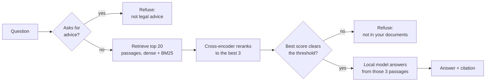

# Fineprint

A fully local RAG assistant for your own paperwork: load a PDF, DOCX, TXT or MD file
and ask it questions, offline, built to be measured rather than demoed.

It answers by quoting the clause the answer came from, and refuses when your documents
don't contain the answer. That much is a common shape. What this repository is actually
about is the evaluation behind it: a golden set with known outcomes, a deliberately
colliding test corpus, retrieval scored at the passage level rather than the document
level, threshold calibration, and a per-sentence audit of every answer. Several of those
measurements overturned a default. Where a design choice is a judgement rather than a
result, it is labelled as one.

Nothing is uploaded. Personal paperwork carries names, addresses, ID and account numbers,
so every step runs on device: parsing, embedding, retrieval and answer generation. No API
keys, no network calls at query time. The runtime is Microsoft Foundry Local. Fineprint
reports what a document says; it does not give legal advice.

The examples below are answered from `evaluation/corpus/`, the 31-document test corpus
these numbers are measured against (see [Setup](#setup)) - not documents Fineprint ships
preloaded with. The app itself opens on an empty library; see [Use](#use).

**[How it works](#how-it-works) · [Setup](#setup) · [Use](#use) · [Results](#results) ·
[Design decisions](#design-decisions) · [Limits](#limits)**

```
Q: How many days do I have to send a proof of loss after a flood loss?
A: Within 60 days after the loss you must send a proof of loss, signed and sworn
   to by you. Source: nfip_flood_insurance_policy.md, VII. General Conditions

Q: What is the interest rate on my mortgage?
A: I could not find this in your documents.
   The model was never called: nothing cleared the relevance threshold.

Q: Should I file a flood insurance claim for this damage?
A: I can only tell you what your documents say, not what you should do.
```

## How it works



Both refusals and the relevance gate run in plain Python before the model is ever called,
so they are deterministic and unit tested, not a prompt the model might ignore. See
[ADR 4](docs/adr/0004-refusal-decided-in-code.md). Retrieval and reranking are covered in
[ADR 2](docs/adr/0002-hybrid-retrieval-with-rrf.md) and
[ADR 8](docs/adr/0008-cross-encoder-reranking.md); the full module-level diagram is in
[docs/architecture.md](docs/architecture.md).

## Setup

Requires Python 3.11 or later and about 4 GB of free disk for the models.

```bash
git clone https://github.com/ZalOZKAN/fineprint-rag
cd fineprint-rag
pip install -r requirements.txt
```

Install the Foundry Local runtime, which downloads and runs the models on device:

```bash
winget install Microsoft.FoundryLocal      # Windows
```

Check what the runtime will use. Every model in the catalog currently ships as a CPU build, so
this is a diagnostic rather than a required step, but it is the first thing to run if answers
are slower than the numbers below:

```bash
python scripts/check_hardware.py
```

Build the index for the evaluation corpus, so the CLI and the numbers below are
reproducible. The first run downloads the Foundry models, which takes a few minutes. The
first question additionally downloads the ~90 MB cross-encoder reranker from the Hugging Face
hub (once, then cached); set `RERANK_ENABLED = False` in `config.py` to skip it.

```bash
python -m rag.ingest
```

`evaluation/corpus/` already holds this corpus: 31 real public-domain federal regulations,
the kind of paperwork a person actually runs into. Credit-card and mortgage disclosure rules
(Regulations B, DD, E, F, M, V, X), FTC consumer rules (cooling-off, mail order, used cars,
funerals, subscriptions), the FMLA and the wage-and-hour rules, OSHA recordkeeping and
inspections, and the whole NFIP flood-insurance program. They overlap heavily, which is what
makes retrieval measurable. Provenance and licensing are in
[evaluation/corpus/LICENSES.md](evaluation/corpus/LICENSES.md); regenerate the six-document
core with `python scripts/fetch_public_corpus.py`, or the full set with `--wide`. This
corpus is what `python -m rag.ingest` and the CLI below read; it is not where your own
documents go, and adding a personal file to it would mix it into these measurements.

## Use

To ask questions about your **own** documents, use the web app: it keeps a personal
library (`data/library/`, `data/library.db`), entirely separate from the evaluation corpus
and database above. A clone opens on an empty workspace, not someone else's 31 documents.

```bash
python -m streamlit run app.py
```

Click the attach icon next to the chat box to add a PDF, DOCX, TXT or MD file - it is
indexed locally in seconds, never uploaded anywhere. Re-adding an unchanged file is cheap:
it is skipped by content hash. If you want to try the app against the same corpus the CLI
and the evaluation below use, open **Documents** in the sidebar and load it there instead of
adding your own files.

The CLI always reads the evaluation corpus directly, which is what makes it useful for
reproducing the numbers below rather than for your own paperwork:

```bash
python cli.py                                   # interactive prompt, evaluation corpus
python cli.py "how long do I have to file a proof of loss"   # single question
python cli.py --audit "how many days to report a fatality"   # show per-sentence provenance
python cli.py --mode hybrid "cooling-off period"             # try another retrieval strategy
```

`--audit` re-embeds each sentence of the answer and reports which retrieved passage it
matches and how strongly. It is a diagnostic, not a second guard: it never changes the
answer, only describes how it was built. The Streamlit app shows the same breakdown in an
expander under the sources.

## Results

All numbers below are one run on one laptop with `qwen3-4b`, dense retrieval with the
cross-encoder reranker on, the reranker-score gate, three passages of context. The corpus is
the 31 documents in `evaluation/corpus/` (about 7,700 passages) - see [Setup](#setup).

### The main set

`evaluation/golden_set.json` is 29 questions with known outcomes: 16 answerable from the
corpus, 8 whose answer is absent, and 5 that ask for a recommendation rather than for what a
document says. Every answerable question names a verbatim clause it must quote.

| | value |
| --- | --- |
| Overall | 89.7 % (26/29) |
| Answer accuracy (16 answerable) | 81.2 % (13/16) |
| No fabrication (13 refusable) | 100 % (13/13) |
| Gate fired before the model (13 refusable) | 100 % (13/13) |
| Latency p50 | 49 s |
| Latency p95 | 106 s |

Every refusable question was stopped before the model by a deterministic guard. The three
answerable misses are all figures the retriever did not place in the context on this larger
corpus: the five-year OSHA record-retention period, the first-class-mail refund method, and
which days count as business days under the Cooling-Off Rule (retrieval returned Regulation E
passages about "business day" instead). The model cannot quote a clause it never saw.

The corpus was grown from 6 documents to 31 deliberately, to see what breaks. Two things
did. **The gate threshold had to be recalibrated**: at the 6-document value of 0.52, five
not-in-corpus questions now scored above it, because the larger corpus holds a passage
loosely related to almost any consumer question (ask about paid sick leave and it retrieves
the FMLA, which is unpaid). Recalibrating to 0.60 closed that gap and restored the 100 %
no-fabrication and gate figures above. **Answer accuracy dropped** from 87.5 % on the small
corpus, because passage-level retrieval got harder with 25 more documents of near-neighbours;
see Retrieval below.

### The harder set

`evaluation/golden_set_hard.json` is 15 questions whose answer collides with a near
neighbour: OSHA carries 8-hour, 24-hour, 7-day and 5-year deadlines; a mail-order refund is
30 days and a flood renewal is also 30 days; the cooling-off window is the third or the fifth
business day depending on the sale.

| | value |
| --- | --- |
| Overall | 73.3 % (11/15) |
| Latency p50 | 63 s |
| Latency p95 | 310 s |

Three of the four failures are `generation_failed`, not wrong answers: on this corpus
`qwen3-4b` intermittently streams for four to five minutes and returns nothing at all. The
character and repetition guards cannot catch it because there is no text, and the wall-clock
ceiling in [ADR 6](docs/adr/0006-bounded-generation.md) cannot interrupt a native call that
is not yielding, so it only fires once the call finally returns. This is the honest floor of
running a 4B model through this runtime on CPU: a rare question hangs for minutes.

### Retrieval: strategy, and reranking

`evaluation/compare_retrieval.py` scores retrieval on its own, with no generation, at two
levels. **doc hit@k** asks whether the right document reached the top `k` passages;
**passage hit@k** asks whether the specific clause that answers the question did, matched
against the `expect_phrase` field in the golden set. With `CONTEXT_CHUNKS = 3`, passage
hit@3 is exactly "did the model get the sentence it needed", and it is an upper bound on
answer accuracy.

On the 31-document corpus, dense retrieval alone puts the answering clause in the top 3
about 69 % of the time on the main set and 53 % on the hard set. That is the real ceiling on
answer accuracy: the misses in the tables above are almost all clauses that never reached
the model.

A cross-encoder then reranks the top 20 dense candidates down to 3, reading each question and
passage together instead of comparing them as vectors ([ADR 8](docs/adr/0008-cross-encoder-reranking.md)):

| | main psg hit@1 | main psg hit@3 | hard psg hit@1 | hard psg hit@3 | hard MRR |
| --- | --- | --- | --- | --- | --- |
| dense | 31 % | 69 % | 20 % | 53 % | 0.73 |
| dense + rerank | **56 %** | 69 % | **53 %** | 53 % | **0.82** |

`psg hit@1` roughly doubles on both sets: the answering passage lands first far more often,
which is the position the model weights most, and MRR rises with it. `psg hit@3` does not
move. Reranking 20 pairs costs about 80 ms against ~60 s of generation. It is on by default;
`--no-rerank` turns it off.

### The ceiling, and three things that did not lift it

`psg hit@3` is the ceiling on answer accuracy, and three plausible fixes have now been
measured against it. None moved it:

| Attempt | Result | Record |
| --- | --- | --- |
| Widen the reranked pool, 20 to 40 to 60 | no change; 40 and 60 *lower* `psg hit@1` on the hard set | [ADR 8](docs/adr/0008-cross-encoder-reranking.md) |
| Change the fusion strategy, dense vs sparse vs hybrid | identical once reranking runs | [ADR 2](docs/adr/0002-hybrid-retrieval-with-rrf.md) |
| Query expansion: retrieve with rewritten phrasings and fuse | **-12 points** without reranking, **exactly zero** with it | [ADR 9](docs/adr/0009-query-expansion.md) |

The expansion result is the informative one. Rewriting the question into its content words
and a rule-scoped variant, then fusing all three rankings, costs about 12 points of
`psg hit@3` in every retrieval mode when there is no reranker, because RRF scores a passage
by agreement across rankings and two of the three rankings now come from degraded queries.
With the reranker on, the shipping configuration, it changes nothing at all: `56.2 / 68.8 /
0.833` before and after, in all three modes. A cross-encoder that reads the question and the
passage together does not care what order the first stage handed them over in.

What those three share is that they rearrange or re-weight the *same* candidate set. That is
the evidence for where the ceiling actually lives: the answering sentence is probably not
independently retrievable, because the 700-character chunk holding it is dominated by its
neighbours. Finer units or a stronger retriever is the untried direction, and neither is a
flag. `QUERY_EXPANSION_ENABLED` stays off; `--expand` reruns the experiment.

Retrieval strategy itself (dense vs sparse vs equal-weight hybrid) was compared earlier on
the six-document corpus, where dense won and equal-weight hybrid lost; on 31 documents sparse
becomes more competitive as exact-term matching starts to matter. `dense` stays the default.
Full reasoning in [ADR 2](docs/adr/0002-hybrid-retrieval-with-rrf.md).

### The relevance gate, and why it moved to the reranker score

The gate decides when the assistant refuses before calling the model.
`evaluation/calibrate_threshold.py` reads the recorded scores and reports the value that
best separates answerable questions from absent ones.

It used to gate on the best dense cosine similarity. Going from 6 to 31 documents that
threshold had to be moved from 0.52 to 0.60: the absent questions' top score rose from 0.502
to 0.585, because a 31-document corpus almost always holds *something* loosely on topic.
Recalibrating closed the gap, but a gate that needs re-tuning every time the corpus changes
is fragile.

The gate now uses the **cross-encoder reranker's top score** instead (when the reranker is
on, which is the default). The reranker already reads each question and passage together to
judge relevance; that judgement is a better "is this actually answerable" signal than vector
proximity, and it barely moves as the corpus grows:

| 31-document corpus | dense cosine | reranker score |
| --- | --- | --- |
| answerable (16) | 0.611 to 0.850 | 1.90 to 9.39 |
| not in corpus (8) | 0.250 to 0.585 | -10.31 to 1.44 |
| gate value used | 0.60 | 1.7 (`RERANK_RELEVANCE_THRESHOLD`) |

Both give a clean split and classify all 24 correctly on this corpus, so answer quality is
unchanged. The reason to prefer the reranker score is that a relevance judgement transfers
across corpora with less retuning than a raw similarity. `--no-rerank` falls back to the
cosine gate.

### Earlier experiments

Two experiments were run against previous corpora and are not repeated here because switching
corpus changed every number. They still inform the defaults:

- **Model size.** `qwen3-0.6b`, `1.7b` and `4b` over the same questions. Only 4b answered
  every question correctly, and on real federal regulation the smaller models hedge instead
  of extracting the figure. It is the default. [ADR 7](docs/adr/0007-chat-model-size.md).
- **Context passages.** Two passages instead of three saved about a second of p50 with no
  accuracy loss on a clean corpus. The default stays at three; `--context-chunks 2` is
  available. [ADR 6](docs/adr/0006-bounded-generation.md) covers the generation bounds.

Reproduce with:

```bash
python evaluation/run_eval.py                                        # main set, configured mode
python evaluation/run_eval.py --golden-set evaluation/golden_set_hard.json
python evaluation/run_eval.py --compare                              # dense and hybrid side by side
python evaluation/calibrate_threshold.py --rerank                    # gate threshold from scores
python evaluation/compare_retrieval.py --rerank                      # retrieval only, with and without reranking
python evaluation/run_eval.py --no-rerank                            # answer quality without the reranker
python evaluation/compare_retrieval.py --rerank --expand              # query expansion, on and off
```

Unit tests prove the code does what it was written to do; they say nothing about whether the
answers are right. That is what the evaluation set is for, and the two are reported separately.

```bash
python -m pytest tests/ -q
```

## Design decisions

| Decision | Record |
| --- | --- |
| One SQLite file instead of a vector database | [ADR 1](docs/adr/0001-sqlite-as-the-vector-store.md) |
| Retrieval strategy, measured at passage level: dense is the default | [ADR 2](docs/adr/0002-hybrid-retrieval-with-rrf.md) |
| Split on headings before size | [ADR 3](docs/adr/0003-heading-aware-chunking.md) |
| Refusal decided in code, not by the model | [ADR 4](docs/adr/0004-refusal-decided-in-code.md) |
| Execution providers, and a retracted speedup claim | [ADR 5](docs/adr/0005-register-execution-providers.md) |
| Generation bounded in the stream wrapper | [ADR 6](docs/adr/0006-bounded-generation.md) |
| Chat model chosen by measurement | [ADR 7](docs/adr/0007-chat-model-size.md) |
| Cross-encoder reranks retrieval candidates | [ADR 8](docs/adr/0008-cross-encoder-reranking.md) |
| Query expansion, measured and rejected | [ADR 9](docs/adr/0009-query-expansion.md) |

[docs/architecture.md](docs/architecture.md) has the data flow and the module layout.

## Limits

- Retrieval is the ceiling. Passage hit@3 is 69 % on the main set and 53 % on the hard set,
  so roughly a third to a half of the answering clauses never reach the model. Both
  answer-accuracy misses on the main set are exactly this: the figure was not retrieved.
  Widening the reranked pool, switching fusion strategy and rewriting the query were all
  tried and none moved it (see Retrieval above); finer chunks or a stronger retriever is
  the untried direction.
- Dense search is a linear scan over every passage. Fine for one person's paperwork, wrong for
  a document store with millions of passages.
- The advice heuristic is pattern matching over the question. It will miss phrasings it does
  not cover. Its accuracy is measured rather than assumed.
- Generation dominates response time and runs on the CPU. Every model in the Foundry Local
  catalog ships only a `generic-cpu` build, so a discrete GPU cannot be used. Timings here are
  from one laptop and are not a general claim.
- A scanned PDF falls back to plain text extraction and loses heading structure, so those
  documents chunk by size and cite only a filename.
- The threshold was calibrated against the same set it is scored on, and the advice patterns
  were widened to fit earlier misses. The hard set, which was not tuned to, scores lower
  (73.3 %, see above) and varies run to run with the native-stall risk. A smaller model
  (`qwen3-1.7b`) hedged on this regulation instead of extracting figures, which is why the
  default is `qwen3-4b` despite its slower tail.

## License

MIT, see [LICENSE](LICENSE).
